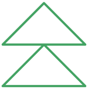
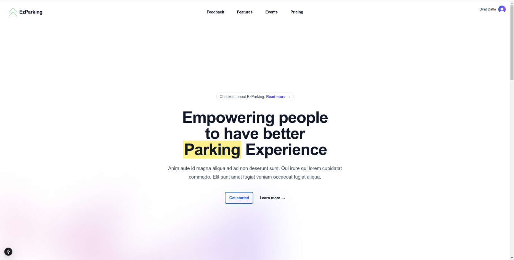
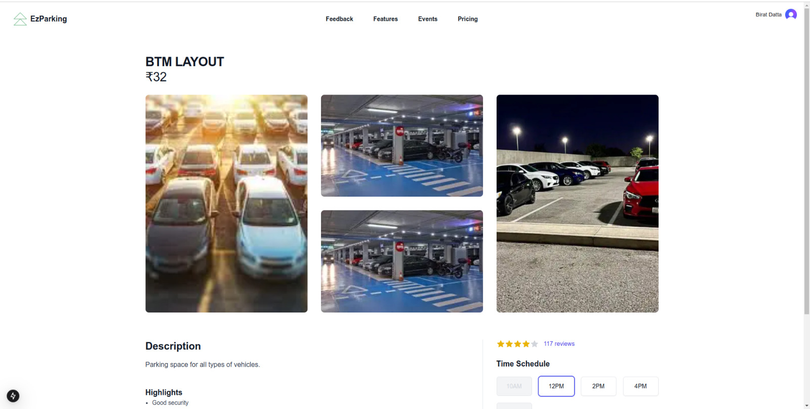
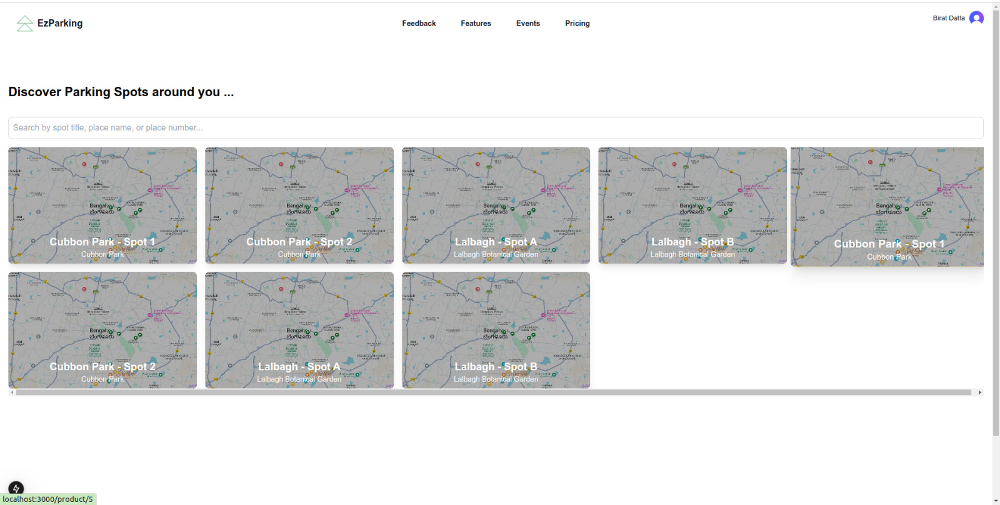
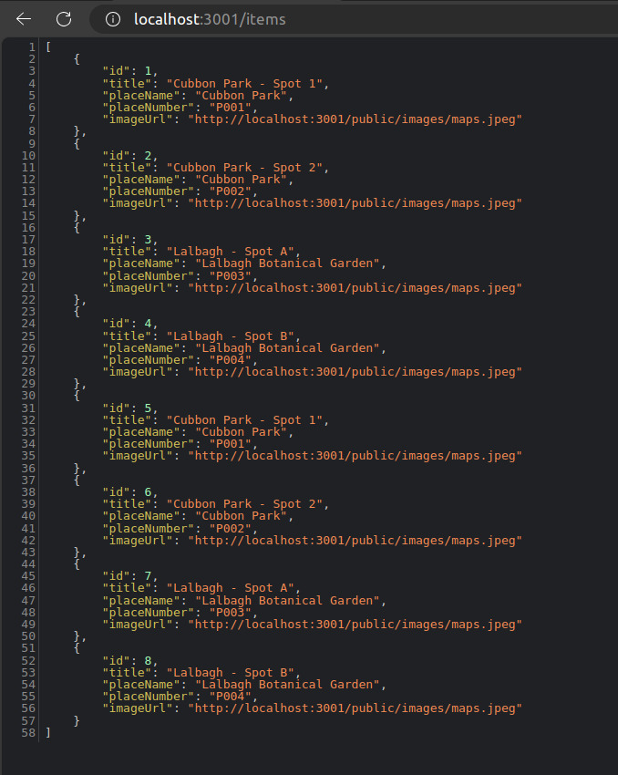

 
<a id="readme-top"></a>


<!-- PROJECT LOGO -->
<br />
<div align="center">
  <a href="https://github.com/biratdatta">
    
  </a>

  <h3 align="center">ezparkapp</h3>

 <p align="center">
    An all in one Parking Application with Frontend, Backend and CV for parking spots
    <br />
    <a href="https://github.com/biratdatta"><strong>Explore the apps »</strong></a>
    <br />
    <br />
    <a href="https://github.com/biratdatta/ezpark-next-app">Frontend</a>
    ·
    <a href=" https://github.com/biratdatta/ezpark-backend">Backend</a>
    ·
    <a href="https://github.com/biratdatta/ezpark-cv">CV</a>
  </p>
</div>


<!-- TABLE OF CONTENTS -->
<details>
  <summary>Table of Contents</summary>
  <ol>
    <li>
      <a href="#about-the-project">About The Project</a>
      <ul>
        <li><a href="#built-with">Built With</a></li>
      </ul>
    </li>
    <li>
      <a href="#getting-started">Getting Started</a>
      <ul>
        <li><a href="#prerequisites">Prerequisites</a></li>
        <li><a href="#installation">Installation</a></li>
      </ul>
    </li>
    <li><a href="#usage">Usage</a></li>
    <li><a href="#roadmap">Roadmap</a></li>
    <li><a href="#contributing">Contributing</a></li>
    <li><a href="#license">License</a></li>
    <li><a href="#contact">Contact</a></li>
    <li><a href="#acknowledgments">Acknowledgments</a></li>
  </ol>
</details>


<!-- ABOUT THE PROJECT -->
## About The Project

 

 We have created a Parking Spot booking service with integreated Backend written in typescript on NestJS with a CV model that detects how many parking spots are left and dynamicaly update the entire thing on the Go. 


This is made by the efforts of [Anish Kumar](https://github.com/Anish-Kumar-404) , [Harshan N](https://github.com/Harsha8321), Anirudh G and Birat Datta
 

<p align="right">(<a href="#readme-top">back to top</a>)</p>


### Built With

 

 
 [](#)
[](#)
 [](#)
[](#)
[](#)

<p align="right">(<a href="#readme-top">back to top</a>)</p>


<!-- GETTING STARTED -->
## Getting Started

 Install all the dependencies on all the files and start working on it 

### Prerequisites

This is an example of how to list things you need to use the software and how to install them.
* npm
  ```sh
  npm install npm@latest -g
  ```
 
* pip 

```sh
 sudo apt-get install python-pip
```

### Installation

 

1. Get a free API Key at [Clerk](https://clerk.com/) for the Clerk in Authentication and 
for the GeoLocation at [opencage](https://opencagedata.com/)
2. Clone the repo
   ```sh
   git clone https://github.com/biratdatta/[gitrepo]
   ```
3. Install NPM packages
   ```sh
   npm install
   ```
   and
   ```sh
   pip3 install requirements
   ```

4. Enter your API in `.env.local`
   ```md
    NEXT_PUBLIC_CLERK_PUBLISHABLE_KEY=pk_test_your_publishable_key
    CLERK_SECRET_KEY=sk_test_your_secret_key
    NEXT_PUBLIC_OPENCAGE_API_KEY=your_opencage_api_key

   ```
 

<p align="right">(<a href="#readme-top">back to top</a>)</p>


<!-- USAGE EXAMPLES -->
## Demo

 
 

 

 

 


 

<p align="right">(<a href="#readme-top">back to top</a>)</p>


 


<!-- CONTRIBUTING -->
## Contributing

Contributions are what make the open source community such an amazing place to learn, inspire, and create. Any contributions you make are **greatly appreciated**.

If you have a suggestion that would make this better, please fork the repo and create a pull request. You can also simply open an issue with the tag "enhancement".
Don't forget to give the project a star! Thanks again!

1. Fork the Project
2. Create your Feature Branch (`git checkout -b feature/AmazingFeature`)
3. Commit your Changes (`git commit -m 'Add some AmazingFeature'`)
4. Push to the Branch (`git push origin feature/AmazingFeature`)
5. Open a Pull Request

 


<!-- LICENSE -->
## License

Distributed under the MIT License. See `LICENSE.txt` for more information.

<p align="right">(<a href="#readme-top">back to top</a>)</p>


<!-- CONTACT -->
## Contact

 Birat Datta - [@biratdatta1](https://twitter.com/biratdatta1) - birat.datta26@gmail.com

ezparkapp: [https://github.com/biratdatta/ezparkapp](https://github.com/biratdatta)

<p align="right">(<a href="#readme-top">back to top</a>)</p>


 
 

